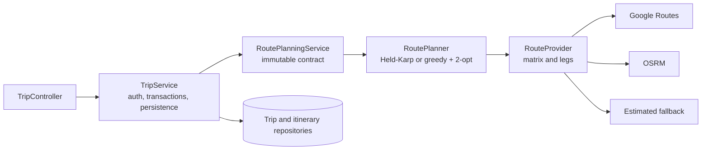
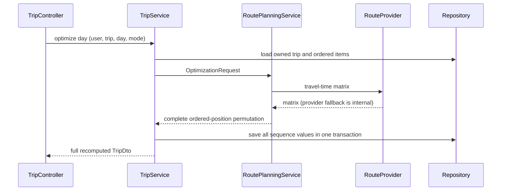

# Itinerary optimization architecture

## Scope

This document defines the backend boundary for route optimization. The REST contract is unchanged:

- `POST /api/trips/{tripId}/days/{dayIndex}/optimize` optimizes one persisted day.
- `POST /api/trips/{tripId}/optimize` applies the same operation independently to every day.
- `POST /api/trips/{tripId}/rebalance` is a separate concern: it may move stops between days and then
  invokes single-day optimization.

“Optimize all days” is not a global multi-day TSP. It preserves day assignments and optimizes each
day independently. Rebalancing owns cross-day movement.

## Component boundary

`TripService` owns user authorization, trip/day validation, transaction scope, loading entities,
persisting the returned order, and assembling `TripDto`. It depends only on
`RoutePlanningService`, so a test can replace route computation with a deterministic fake.

`RoutePlanner` owns the optimization objective, algorithm selection, locked-slot constraints, and
timeline calculation. It does not read or write the database and does not know about users or trips.

`RouteProvider` owns travel matrices and route legs. Provider selection, caching, external failures,
and fallback remain below the optimization boundary.

## Optimization contract

`RoutePlanningService.OptimizationRequest` contains:

- an immutable, position-ordered list of `OptimizationStop(position, poi, locked)`;
- the travel mode;
- the local day-start hour.

Positions must be contiguous and zero-based. A locked stop must occupy the same output slot as its
input position. `OptimizationResult` returns a full permutation of input positions and reports the
selected algorithm (`NO_OP`, `HELD_KARP`, or `GREEDY_TWO_OPT`). The caller persists this order only
after a complete result is returned.

For at most 12 stops, `RoutePlanner` uses exact Held-Karp bitmask dynamic programming. For larger
days, it uses earliest-completion greedy ordering followed by 2-opt. Both paths enforce locked slots.
The lexicographic objective is:

1. minimize minutes spent visiting after a venue closes;
2. then minimize the local time at which the day finishes, including travel and waiting.

`buildDay` is the read-side planning contract. Given an already ordered POI list, it returns an
immutable timeline with travel legs and semantic warning codes.

## Request sequence and failure behavior

The database update is transactional: no partial order is persisted if planning fails. Repeating an
optimization request against unchanged trip data, mode, provider data, and configuration is
idempotent in persisted effect. External traffic-dependent matrices can legitimately produce a new
optimal order later, so this is not byte-for-byte temporal determinism.

## Test strategy

- Contract tests validate request invariants and immutable values.
- `RoutePlannerTest` tests objective behavior, algorithm output, permutation completeness, and locked
  slots—including a lock in the middle of a day.
- `TripService` tests should inject a fake `RoutePlanningService` to verify entity-to-contract mapping,
  persistence, authorization, and rollback without exercising a route provider.
- Provider tests independently cover matrices, cache keys, timeouts, and fallback.

This separation keeps algorithm tests fast and deterministic while integration tests remain focused
on transaction and API behavior.

